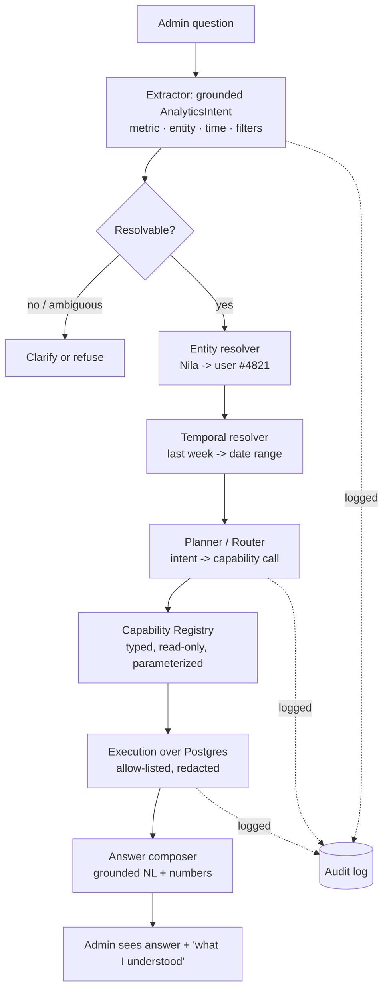

# PRD — Admin Insights Assistant ("Ask the Data")

Status: **Draft / proposal** · Owner: platform team · Last updated: 2026-08-03

> A natural-language analytics chatbot for admins. An admin types a question — *"how many
> matches finished today?"*, *"how many wins does Nila have this week?"* — and gets a
> correct, grounded answer, backed by safe read-only queries over our own data.
>
> This is **not** "let an LLM write SQL against the prod DB." It is a curated, governed
> capability layer (the *API wrapper*) fronted by a grounded intent extractor (the *text
> extractor*, inspired by **LangExtract**) — conceptually **MCP-like, but domain-curated,
> permissioned, audited, and privacy-enforcing** rather than a generic tool protocol.

---

## 1. Summary

We already ship an admin-only AI chat panel that proxies to OpenAI (server-side key, see
`docs`/admin AI tab). Today it's a raw chat — it has no access to our data. This PRD
specifies turning it into an **Insights Assistant**: the admin asks a question in plain
language and the system

1. **extracts a structured, grounded intent** from the question (metric, entity, time
   window, filters) — LangExtract-style, with each parameter traced back to the words that
   produced it;
2. **routes that intent to a whitelisted "capability"** — a typed, read-only, parameterized
   function over our DB (the "API wrapper", MCP-like registry);
3. **executes** it safely and **composes a concise natural-language answer** that cites the
   numbers, the resolved entity, and the exact date range.

Every step is logged; no model ever authors raw SQL; `telegram_id` and other secrets never
enter a prompt or a response.

---

## 2. Problem & motivation

Admins currently answer operational questions by opening the **Data** tab and eyeballing
tables, or by asking an engineer to run a query. Both are slow and don't scale as the
schema grows (users, matches, dice_rolls, knockouts, card_draws, polls, …).

We want a **self-serve, conversational** way to ask common operational questions and trust
the answer. The bar is **correctness + explainability**, not cleverness: a wrong number
delivered confidently is worse than no answer.

---

## 3. Goals / Non-goals

**Goals**
- Answer common admin analytics questions in natural language, correctly and fast (< 3 s).
- **Grounded & explainable**: every answer shows what the assistant understood (entity it
  resolved, the exact date range, the capability it ran) so an admin can trust/verify it.
- **Safe by construction**: read-only, admin-only, parameterized, allow-listed; no
  model-authored SQL; `telegram_id` never exposed.
- **Extensible**: adding a new answerable question = registering one new capability, no
  prompt surgery.
- Full **audit trail** of question → resolved intent → capability call → result.

**Non-goals (initial)**
- Free-form SQL generation or arbitrary DB access.
- Writes/mutations of any kind (no "ban this user" via chat — read-only only).
- Charts/dashboards (text answers first; visualization is a later phase).
- End-user (player) facing analytics. Admins only.
- Replacing the existing Data browser — this complements it.

---

## 4. Target users & example queries

**User:** an app admin (gated by `ADMIN_IDS`, same as the current admin panel).

**Representative questions (the initial target set):**

| # | Question | Metric | Entity | Time |
|---|----------|--------|--------|------|
| Q1 | How many users do we have? | user count | — | all-time |
| Q2 | How many matches were played today, and how many finished? | match counts by status | — | today |
| Q3 | How many wins does the user "Nila" have in the last week? | wins | user *Nila* | last 7 days |
| Q4 | Who are the top 5 players by wins this month? | leaderboard | — | this month |
| Q5 | How many cards were drawn yesterday? | card_draws count | — | yesterday |
| Q6 | How many games is Ali currently playing? | live matches for user | user *Ali* | now |
| Q7 | What's our knockout leader all-time? | knockouts leader | — | all-time |

These map to a small, growing **capability catalog** (§13). The assistant should also
gracefully **refuse or ask to clarify** anything outside the catalog rather than guess.

---

## 5. Prior art & positioning

### 5.1 LangExtract (what we borrow)
Google's LangExtract extracts **structured information from unstructured text** using an LLM
guided by a **prompt + few-shot examples + an optional schema**, and — critically — **grounds
every extracted value to its exact character span** in the source. It's provider-agnostic
(Gemini/OpenAI/Ollama), chunks long inputs, and emits structured JSON.

We reuse this pattern for **question → intent** understanding:
- The "document" is the admin's short question.
- The "extractions" are the intent fields: `metric`, `entity`, `time_range`, `filters`,
  `group_by`, `limit`.
- **Grounding** lets the UI show *"I read 'last week' → 2026-07-27…2026-08-02"* and *"'Nila'
  → user #4821"*, which is the trust mechanism. If a span can't be grounded, we ask instead
  of guessing.

### 5.2 MCP (what we improve on)
The Model Context Protocol standardizes exposing **tools/resources** to an LLM. It's great
for interoperability, but generic: any registered tool is callable, governance is up to the
host, and it says nothing about grounding, auditing, or domain safety.

**"Like MCP but more professional"** here means a **curated, first-party capability
registry** with properties a generic protocol doesn't give us out of the box:

| Concern | Generic MCP tool server | This design |
|---|---|---|
| Tool surface | whatever's registered | **curated, versioned catalog** of vetted analytics capabilities |
| Query safety | host's responsibility | **no model SQL** — capabilities are hand-written, parameterized, read-only |
| Privacy | not enforced | **redaction baked in** (`telegram_id` etc. can never be selected) |
| Grounding | none | **LangExtract-style** intent grounding + answer citations |
| AuthZ | transport-level | **admin-gated**, per-capability permissions |
| Observability | none standard | **full audit log** + metrics + replay |
| Determinism | model picks & fills tools | **deterministic router first**, LLM tool-calling only as fallback |

We can *also* expose the same capabilities over MCP later (§16, Phase 4) so external agents
can use them — but the governed registry is the product, MCP is a transport.

---

## 6. Architecture overview



Two pillars, as requested:
- **Text extractor** = steps B–E (understand + ground the question).
- **API wrapper** = steps F–H (the capability registry + safe execution).
- The **chatbot** = the loop tying them together, plus the composer (I).

---

## 7. Component specs

### 7.1 Capability Registry (the "API wrapper")
The heart of the system. A **capability** is a hand-authored, typed, read-only unit of
analytics. It is the *only* way the assistant can touch data.

A capability declares:
- `name` — stable id, e.g. `matches.count_by_status`.
- `summary` — one line, used by the planner/LLM to select it.
- `params` — JSON Schema (types, enums, defaults, required). e.g. `period`, `status`.
- `handler` — a Python coroutine that runs a **fixed, parameterized SQLAlchemy query**
  (no string interpolation of user input; enums validated against the schema).
- `redactions` — columns that must never appear (defaults include `telegram_id`).
- `examples` — question→call pairs, used both for planner few-shots and for tests.
- `permissions` — `admin` (all, for now).
- `version` — capabilities are versioned; changing a result shape bumps it.

> Capabilities are **not** generated by the model. They are reviewed code. The model only
> *chooses* a capability and *fills its typed params*.

Example (illustrative spec, not code to ship in this PRD):
```yaml
name: users.count
summary: Total number of real (non-bot) players, optionally created within a period.
params:
  period: { type: string, enum: [all, today, yesterday, 7d, this_month, custom], default: all }
  created_between: { type: [range, "null"], default: null }   # when period=custom
returns: { count: int, period: {from, to} }
examples:
  - q: "how many users do we have?"          -> { period: all }
  - q: "how many signups this week?"          -> { period: 7d }
redactions: [telegram_id]
```

### 7.2 NL Understanding — grounded intent extraction (LangExtract-style)
Input: the raw question. Output: an **AnalyticsIntent** (see Appendix A) with **grounding
spans**. Implementation options, in order of preference:

- **Preferred:** structured extraction with few-shot examples + a JSON schema for
  `AnalyticsIntent`, exactly the LangExtract pattern (prompt + examples + schema,
  grounded). We can call LangExtract directly (it supports OpenAI) or replicate its
  extraction contract against our existing OpenAI proxy.
- Each field records the **source span** it came from, so the UI can show what was read.
- Low-confidence or unmapped spans → `needs_clarification` with a suggested question.

### 7.3 Entity resolution
"Nila", "Ali" → a concrete user. Deterministic, not LLM:
- Match on `first_name` / `username` (case-insensitive, exact → prefix → fuzzy/trigram).
- **Ambiguity handling:** if >1 candidate, return the top few (name, level, last_seen) and
  ask the admin to pick — never silently choose. Results reference the **public `id`**;
  `telegram_id` is never surfaced.
- Bots excluded unless explicitly asked.

### 7.4 Temporal resolution
"today", "yesterday", "last week", "this month", "last 7 days" → concrete `[from, to)` in a
**fixed, configured timezone** (avoid "today" ambiguity). Deterministic library, unit-tested.
Surfaced in the answer ("today = 2026-08-03 00:00…24:00 +03:30").

### 7.5 Planner / Router
Maps a resolved intent to one or more capability calls.
- **Deterministic-first:** a rules table maps `(metric, filters)` → capability + param
  mapping for the known catalog. Fast, testable, no tokens.
- **LLM fallback (function-calling):** for compound/novel phrasings, present the capability
  catalog as function schemas and let the model select + fill — but the model may only call
  **registry** functions with **schema-valid** args. Compound questions (Q2: "played today
  **and** finished") fan out to multiple calls.
- Guardrail: if no capability fits, **refuse with a helpful message** listing what can be
  asked. Never fabricate.

### 7.6 Execution layer
- Runs the capability's fixed query on a **read-only** DB session/role.
- Enum/param values are validated against the capability schema before binding.
- **Redaction** is enforced at the query layer: forbidden columns can't be selected;
  a global deny-list (`users.telegram_id`, secrets) is applied on top of per-capability
  redactions.
- Timeouts + row caps; results are small aggregates by design.

### 7.7 Answer composer
Turns `{intent, capability, result}` into a concise NL sentence. Prefer a **template-first**
composer (deterministic, cite the numbers) with an **optional LLM polish** pass that is
**not allowed to introduce new numbers** — it only rephrases. This prevents hallucinated
figures.

### 7.8 Grounding & explainability
Every answer ships with a compact "**What I understood**" block:
- resolved entity (name → #id), resolved date range, capability + params run, raw result.
This is the LangExtract grounding surfaced to the admin, and the primary trust lever.

### 7.9 Audit log & observability
Append-only `insights_queries` record per turn: admin id, question, extracted intent,
resolved entity/time, capability + params, result summary, latency, model, token cost,
outcome (answered / clarified / refused / error). Enables review, abuse detection, eval
datasets, and "why did it say that?" debugging.

---

## 8. Data-model implications (gaps to close)

Answering the target questions *correctly* exposes real gaps — worth calling out now:

- **`matches` has no `finished_at`.** Q2 ("finished today") currently can only use
  `status='finished'` + `created_at`, which conflates "created today" with "finished
  today". **Recommendation:** add `matches.started_at` / `finished_at` timestamps
  (append-only, additive migration) so time-scoped match metrics are accurate.
- **Wins are a cumulative counter (`users.games_won`), not time-scoped.** Q3 ("wins **last
  week**") cannot come from that counter. It must be derived from `match_seats.place = 1`
  joined to `matches.finished_at` within the window. **Recommendation:** ensure every
  finished match reliably writes `match_seats.place` + a match `finished_at`, and expose a
  capability `users.wins(period)` built on that join.
- **Per-day event volumes** (dice_rolls, knockouts, card_draws) already carry `created_at`,
  so Q5-type questions are answerable today.
- Optional later: a small **rollup/materialized daily-stats** table for cheap trend queries
  as volume grows.

These are additive and independent; the assistant can ship against what's answerable today
and light up more capabilities as the data lands.

---

## 9. Privacy, security & governance

- **Read-only, admin-only.** Reuse `require_admin`. A dedicated read-only DB role is ideal.
- **No model-authored SQL, ever.** The model selects capabilities and fills typed params.
- **`telegram_id` never leaves the server** — enforced as a hard deny-list at the execution
  layer, on top of per-capability redactions. Nothing the model can do exposes it. (This is
  the project's standing rule.)
- **Prompt-injection resistance:** user/free-text data pulled from the DB (chat messages,
  names) is treated as data, never as instructions to the planner.
- **Rate limits + cost caps** on the OpenAI proxy; per-admin quotas.
- **Full audit** (§7.9). **Secrets** (OpenAI key) stay in server env, as today.

---

## 10. API design (proposed)

- `POST /api/admin/insights/ask` — `{ question, conversation_id? }` →
  `{ answer, understood: {entity, period, capability, params}, result, needs_clarification? }`.
- `GET /api/admin/insights/capabilities` — the catalog (names, summaries, params) for the UI
  "what can I ask?" hints.
- `GET /api/admin/insights/log` — recent audited turns (admin review).

All admin-gated. The existing `/api/admin/ai/chat` remains the raw-LLM sandbox; Insights is
the data-grounded path.

---

## 11. Admin UI

Builds on the shipped **AI** tab:
- A chat surface with a **"what I understood"** expander under each answer (entity, date
  range, capability, raw numbers).
- **Suggested prompts** / capability chips so admins learn what's answerable.
- **Disambiguation UI**: when an entity is ambiguous, show candidate players to tap.
- A subtle **"grounded"** vs **"raw AI"** mode toggle (Insights vs sandbox).

---

## 12. End-to-end walkthroughs

**Q1 — "How many users do we have?"**
Extract → `{metric: user_count, time: all}` (ground: none needed). Router → `users.count(period=all)`.
Execute → `{count: 3,412}`. Answer → *"You have **3,412** players (all-time, excluding bots)."*

**Q2 — "How many matches were played today, and how many finished?"**
Extract → two metrics, `time: today` (ground: "today" → 2026-08-03). Router fans out →
`matches.count_by_status(period=today)`. Execute → `{playing: 40, finished: 128, …}`.
Answer → *"Today (Aug 3): **168** matches started, **128** finished, 40 still playing."*
(*Caveat handled per §8 once `finished_at` exists; until then the answer states the basis.*)

**Q3 — "How many wins does 'Nila' have last week?"**
Extract → `{metric: wins, entity: "Nila"(span 27–31), time: last week (span 33–42)}`.
Entity resolver → one match, user #4821 "Nila". Temporal → 2026-07-27…08-02. Router →
`users.wins(user_id=4821, period=custom, range=…)` (join `match_seats.place=1` ×
`matches.finished_at`). Execute → `{wins: 6}`. Answer → *"**Nila** (#4821) won **6** games
between Jul 27–Aug 2."* If two Nilas → disambiguation prompt instead.

---

## 13. Initial capability catalog

Concrete, mapped to the real schema. (Names illustrative.)

| Capability | Answers | Backed by |
|---|---|---|
| `users.count(period)` | total / new users | `users` (is_bot=false) + `created_at` |
| `users.find(name)` | entity resolution | `users.first_name/username` |
| `users.profile(user_id)` | a player's record | `users` (redacted) |
| `users.wins(user_id, period)` | time-scoped wins | `match_seats.place=1` ⋈ `matches.finished_at` |
| `users.live_matches(user_id)` | games in progress | `match_seats` ⋈ `matches.status='playing'` |
| `matches.count_by_status(period)` | started/finished/abandoned | `matches.status` + timestamps |
| `leaderboard.top(metric, period, n)` | top-N by wins/knockouts/etc. | `users` / joins |
| `events.count(kind, period)` | dice_rolls / knockouts / card_draws volume | event tables `created_at` |
| `polls.summary(period)` | polls created / votes | `polls` / `poll_votes` |
| `economy.coins()` | coins in circulation | `sum(users.coins)` |

Each ships with examples (planner few-shots + tests). Adding a question later = adding one
row here.

---

## 14. Model / provider strategy

- Reuse the **server-side OpenAI proxy** already in place (key in env, admin-gated).
- **Extractor** and **composer** are separable; either can run on OpenAI (LangExtract
  supports it) or be swapped for a local model (Ollama) since LangExtract is
  provider-agnostic — useful for cost/privacy later.
- Keep the **planner** as deterministic as possible; only fall back to function-calling for
  novel phrasings. This bounds token cost and maximizes correctness.

---

## 15. Evaluation & success metrics

- **Answer accuracy** on a labeled eval set (the catalog's `examples` + a growing gold set
  from the audit log). Target ≥ 95% on in-catalog questions.
- **Grounding correctness**: entity + date-range resolved correctly ≥ 98%.
- **Safe-refusal rate**: out-of-catalog questions refused/clarified (never fabricated) ~100%.
- **Latency** p50 < 2 s, p95 < 4 s. **Cost** per query tracked.
- **Zero** privacy leaks (automated test asserts `telegram_id` never appears in any output).

---

## 16. Phased rollout

- **Phase 0 — Foundations (spec/infra):** capability registry interface, AnalyticsIntent
  schema, audit table, read-only DB role, timezone/temporal + entity resolvers. No LLM yet;
  everything testable deterministically.
- **Phase 1 — MVP (deterministic):** 5–6 capabilities (users.count, find, wins, live;
  matches.count_by_status; events.count). Deterministic router only, template composer.
  Ships the 3 headline questions. LangExtract-style extractor for entity/time grounding.
- **Phase 2 — LLM planner fallback + polish:** function-calling for novel phrasings, LLM
  answer polish (numbers locked), disambiguation UI, suggested prompts.
- **Phase 3 — Data completeness:** add `matches.finished_at`/`started_at`, time-scoped win
  join, leaderboard/economy capabilities, optional daily rollups.
- **Phase 4 — Interop & viz:** expose the same capabilities over **MCP** for external
  agents; add lightweight charts to answers.

Each phase is independently shippable and reversible.

---

## 17. Risks & mitigations

| Risk | Mitigation |
|---|---|
| LLM hallucinates a number | Numbers only from capability results; composer forbidden to invent; template-first |
| Model writes/leaks via SQL | No model SQL at all; capabilities are reviewed, parameterized, read-only |
| `telegram_id` / secret leak | Hard deny-list at execution; automated leak test; server-side key only |
| Wrong entity ("which Nila?") | Deterministic resolver + explicit disambiguation, never silent |
| Wrong time window | Deterministic temporal resolver, fixed TZ, surfaced in answer |
| Prompt injection via stored text | DB text treated as data, not instructions; planner sees typed intent, not raw rows |
| Cost blowout | Deterministic router first; caps/quotas on the proxy; audit of token cost |
| Answers drift as schema changes | Capabilities versioned; eval set gates changes |

---

## 18. Open questions

- Which **timezone** anchors "today"/"this week" (server, org, per-admin)?
- Do we add `matches.finished_at` now (unblocks accurate time-scoped match/win metrics)?
- OpenAI-only, or invest in a **local extractor** (Ollama) for cost/privacy from day one?
- Should the assistant support **follow-ups** ("…and last month?") — i.e. conversational
  memory of the last intent? (Recommended for Phase 2.)
- How much **write/action** capability (e.g. "ban user X") do we ever want — or stay
  strictly read-only? (Recommend read-only until there's a strong case + confirmations.)

---

## Appendix A — `AnalyticsIntent` (extractor output schema)

```jsonc
{
  "metric": "wins",                     // enum, from the catalog vocabulary
  "entity": {                            // optional
    "type": "user",
    "text": "Nila",                     // grounded span
    "span": [33, 37]
  },
  "time_range": {
    "phrase": "last week",              // grounded span
    "span": [39, 48],
    "from": "2026-07-27T00:00:00+03:30",
    "to":   "2026-08-03T00:00:00+03:30"
  },
  "filters": { "status": null, "is_bot": false },
  "group_by": null,
  "limit": null,
  "confidence": 0.94,
  "needs_clarification": null           // or { field, question, candidates[] }
}
```

## Appendix B — Capability spec (registry entry)

```jsonc
{
  "name": "users.wins",
  "version": 1,
  "summary": "How many games a specific player won in a period.",
  "params": {
    "user_id": { "type": "integer", "required": true },
    "period":  { "type": "string", "enum": ["all","today","7d","this_month","custom"], "default": "all" },
    "range":   { "type": ["object","null"], "default": null }
  },
  "returns": { "wins": "integer", "period": { "from": "datetime", "to": "datetime" } },
  "redactions": ["telegram_id"],
  "permissions": ["admin"],
  "examples": [
    { "q": "how many wins does Nila have last week?",
      "call": { "user_id": "<resolved>", "period": "7d" } }
  ]
}
```

## Appendix C — Audit record

```jsonc
{
  "id": 1024,
  "admin_id": 7,
  "asked_at": "2026-08-03T12:41:09+03:30",
  "question": "how many wins does Nila have last week?",
  "intent": { "...": "AnalyticsIntent" },
  "resolved_entity": { "user_id": 4821, "name": "Nila" },
  "capability": "users.wins",
  "params": { "user_id": 4821, "period": "7d" },
  "result": { "wins": 6 },
  "outcome": "answered",                // answered | clarified | refused | error
  "latency_ms": 1180,
  "model": "gpt-4o-mini",
  "tokens": { "prompt": 812, "completion": 96 }
}
```
